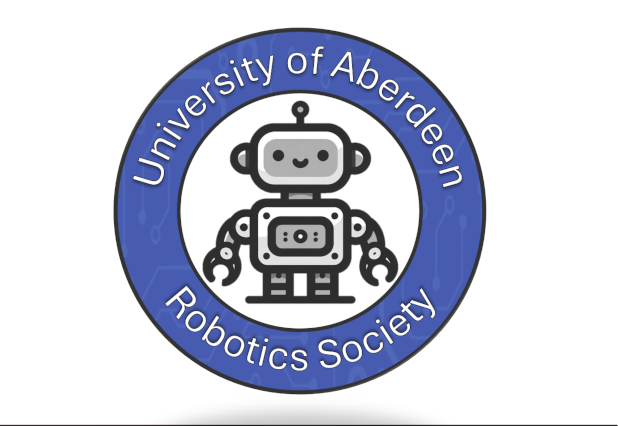

# Aberdeen University Robotics Society 2024-25 Competition Rules - Tag Robots

Version: 0.1

| Version  | Date        | Details                                                                  |
| -------- | ----------- | -------------------------                                                |
| 0.1      | 18/10/2024  | Draft version for comment                                                |
| 1.0      | 20/10/2024  | Weight limit changed to 600g, rules reviewed & approved by the committee |

Significant rule clarifications or alterations will be populated in to the table above, and this document re-issued electronically. The master copy of this document is on github:

https://github.com/dgc-proton/2024-25_Aberdeen_Robotics_Competition
 
## Overview

The tag robot competition will take place in an 'arena'. The arena will consist of a dark surface with white colored tape or paint around the outside of it to define the arena boundry. The white boundary will be at least 2.5cm wide and will be marked in such a way that there are no corners with angles sharper than 45°. The final size and construction of the arena will be revealed closer to the competition date, and competitors will have a chance to test their robots in the arena prior to the competition. The arena might look something like the below:

- Two robots will be placed in the arena, with a person from each team next to their robot in order to press its activation button.
- The referee will dictate the starting position and orientation of each robot.
- One robot will be nominated 'it'. Each robot will need to be able to function in two different modes, either 'it' (trying to tag the other robot), or trying to avoid being tagged by the other robot. A physical switch is to be used to toggle this functionality.
- When the referee shouts 'start', each competitior will press a physical button on their robot which enables it to begin moving.
- A referee will begin the round timer as soon as the round starts.
- Once the round has started, all persons are to immediately step back and remain at least 1m away from the arena boundries; this is to prevent robots detecting peoples legs etc when they are searching for their opponent.
- No robots are permitted to move prior to the round starting.

Each round will last for a pre-determined period of time. During the competition there may be rounds of differing durations. A round ends when either:
1. The two robots make physical contact. In this case the robot that was 'it' wins the round.
2. A robot drives out of the arena. In this case the robot that did not drive out, or that was the last to drive out, wins. A robot has driven out of the arean when any part of it crosses the outer edge of the white arena boundry line.
3. The round time runs out. In this case the robot that was not 'it' wins the round.
4. If the robot that is 'it' does not move for 10 seconds (e.g. it has broken down), then the other robot wins the round.

The decision of the competition judges regarding the above is final.

## Other General Rules

1. If in doubt about any aspect of the rules, ask for clarification. Competitors should comply with both the spirit and the letter of these rules. Ask [Dave](mailto:d.riley.22@abdn.ac.uk?subject=[GitHub]%20Tag%20Robot%20Competition) for clarifications where necessary. If Dave is unavailable, speak to another committee member.
2. Each team can be made up of 1 to 3 people.
3. On the day of the competition each team may only have a single robot in their posession, and this robot must not be physically altered between rounds. For the purpose of this competition 'physically altered' means to add or remove a component. Toggling a switch, or uploading different software between rounds is permitted.
4. If a robot breaks between rounds of a heat and cannot be repaired within 2 minutes then (at the judges discretion) that team forefits that heat.
5. If a robot is unable to continue competing, and therefore not all of the other teams were able to compete against that robot, then all points relating to heats against that robot become void. This is to prevent the teams that have already competed against the robot from gaining an unfair points advantage.

## Construction Specific Rules

1. Robots are to be autonomous and self-contained. All actions must be driven solely by the onboard processor. Remote controls, wifi/bluetooth/other connections and similar things are not allowed.
2. Size: The maximum permitted footprint of a robot is 150mm x 150mm. The maximum permitted height is 200mm.
3. Weight: The maximim permitted weight of a robot is 600g.
4. Robots are not to have any features that will interfere with the operation or movement of the other robot or that are likely to cause damage to it (i.e. no weapons). The competition is about speed, agility and having an effective control algorithm.
5. Robots are not to have any features that may damage the arena.
6. Robots must remain as a complete unit throughout the match, i.e. no parts are allowed to drop off, by design or otherwise.
7. No liquids, powder or gas equipment. No fire or inflammable materials.
8. Only components provided by the society are to be used to construct the robots. If one team wants to use something outside of the provided parts then they should speak to a committee member. If the committe decide to purchase the part, they will also offer the opportunity to use that part to all of the other teams in the competition to ensure a level playing field. Teams are peremitted to use different wires or connectors without approval, and can also make their own chassis provided that it is 'home made' and an off the shelf solution is not used. If in doubt, ask first.

## Prize Catagories

In addition to the main prize for the team who wins the overall tag competition, there will be another prize awarded by the competition judges. The following aspects will be considered when judging for this yet-to-be-named prize:

- The overall design of the robot
- The weight of the robot (lighter is more impressive)
- The overall construction of the robot
- The style of the code for the robot (judges will conduct a brief code review; competitors can opt out of this if they desire)
- The size of the team and the relative experience of its members
- How good the team name is

## Example of Competition Schedule

The general structure will be for every team to play a 3 round heat against every other team. The winner of the heat will get one point. At the end of the competition, the team with the most points wins. Example:

| Team | A | B | C | D | E | Total points |
| ---- | - | - | - | - | - | ------------ |
| A    | X | 1 | 0 | 1 | 0 | 2            |
| B    | 0 | X | 1 | 1 | 0 | 2            |
| C    | 1 | 0 | X | 1 | 1 | 3            |
| D    | 0 | 0 | 0 | X | 0 | 0            |
| E    | 1 | 1 | 0 | 1 | X | 3            |

In the above example teams C & E are drawing, and so will have a best of 3 rounds tiebreaker. If more than two teams get the most points then each of those teams will play each of the other top scoring teams in a points based fashion, similar to how the initial heats worked. This will continue until a winner is decided.
